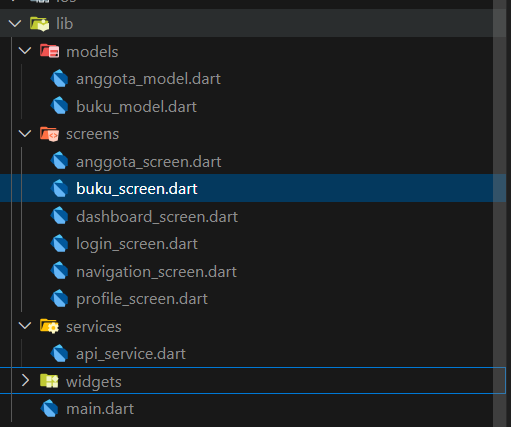

# Clone project Backend nya lalu install sesuai instruksi di README.md baca dengan detail

# **Sesi Flutter**
## jika belum ada project buat dulu   [Buat Project](setup-awal.md), klik tulisan biru

# 1. Sesi Setup awal Flutter

## 1.1 Buat Arsitektur Project sebagai gambar berikut dan pastikan sudah sama baik penempatan folder dan file nya



## 1.2 Install Package HTTP

pada project buka terminal di vscode lalu ketik dan jalankan

```bash
flutter pub add http
```

### atau secara manual

buka folder pubspec.yaml lalu tambahkan `http: ^1.2.2` pada bagian dependecies

```yaml
dependencies:
  flutter:
    sdk: flutter

  # The following adds the Cupertino Icons font to your application.
  # Use with the CupertinoIcons class for iOS style icons.
  cupertino_icons: ^1.0.8
  convex_bottom_bar: ^3.2.0
  http: ^1.6.0
```

# 2. Buat Model anggota dan buku

## 2.1 pada file `lib/models/anggota_model.dart` dan `lib/models/buku_model.dart`

#### a. `lib/models/anggota_model.dart`

copy paste code dibawah ini `ctrl + A` -> `ctrl + c` -> `ctrl + v`

```dart
class Anggota {
  final int id;
  final String nama;
  final String alamat;

  Anggota({required this.id, required this.nama, required this.alamat});

  factory Anggota.fromJson(Map<String, dynamic> json) {
    return Anggota(
      id: json['id'],
      nama: json['name'] ?? '',
      alamat: json['address'] ?? '',
    );
  }
}

```

#### b. `lib/models/buku_model.dart`

copy paste code dibawah ini `ctrl + A` -> `ctrl + c` -> `ctrl + v`

```dart
class Buku {
  final int id;
  final String title;
  final int authorId;
  final int publisherId;
  final String isbn;
  final int tahunTerbit;
  final String kategori;
  final int jumlahStok;

  Buku({
    required this.id,
    required this.title,
    required this.authorId,
    required this.publisherId,
    required this.isbn,
    required this.tahunTerbit,
    required this.kategori,
    required this.jumlahStok,
  });

  factory Buku.fromJson(Map<String, dynamic> json) {
    return Buku(
      id: json['id'] is int ? json['id'] : int.tryParse(json['id'].toString()) ?? 0,
      title: json['title'] ?? '',
      authorId: json['author_id'] is int ? json['author_id'] : int.tryParse(json['author_id'].toString()) ?? 0,
      publisherId: json['publisher_id'] is int ? json['publisher_id'] : int.tryParse(json['publisher_id'].toString()) ?? 0,
      isbn: json['isbn'] ?? '',
      tahunTerbit: json['tahun_terbit'] is int ? json['tahun_terbit'] : int.tryParse(json['tahun_terbit'].toString()) ?? 0,
      kategori: json['kategori'] ?? '',
      jumlahStok: json['jumlah_stok'] is int ? json['jumlah_stok'] : int.tryParse(json['jumlah_stok'].toString()) ?? 0,
    );
  }
}
```

# 3. Buat API Service

## 3.1 pada file `lib/services/api_service.dart`

copy paste code dibawah ini `ctrl + A` -> `ctrl + c` -> `ctrl + v`

```dart
import 'package:http/http.dart' as http;
import 'dart:convert';
import 'package:fe_digital_library/models/anggota_model.dart';
import 'package:fe_digital_library/models/buku_model.dart';

class ApiService {
  final String baseUrl = 'http://localhost:8000/api';

  // Anggota
  Future<List<Anggota>> getAnggota() async {
    final response = await http.get(Uri.parse('$baseUrl/members'));

    if (response.statusCode == 200) {
      final decoded = json.decode(response.body);
      List<dynamic> data;
      if (decoded is List) {
        data = decoded;
      } else if (decoded is Map<String, dynamic> && decoded.containsKey('Member')) {
        data = decoded['Member'];
      } else {
        throw Exception('Format data anggota tidak valid .  Response: ${response.body}');
      }
      return data.map((item) => Anggota.fromJson(item)).toList();
    } else {
      throw Exception('Gagal memuat data anggota . Response: ${response.body}');
    }
  }

  // Buku
  Future<List<Buku>> getBuku() async {
    final response = await http.get(Uri.parse('$baseUrl/books'));

    if (response.statusCode == 200) {
      final decoded = json.decode(response.body);
      List<dynamic> data;
      if (decoded is List) {
        data = decoded;
      } else if (decoded is Map<String, dynamic> && decoded.containsKey('Book')) {
        data = decoded['Book'];
      } else if (decoded is Map<String, dynamic> && decoded.containsKey('data')) {
        data = decoded['data'];
      } else {
        throw Exception('Format data buku tidak valid. Response: ${response.body}');
      }
      return data.map((item) => Buku.fromJson(item)).toList();
    } else {
      throw Exception('Gagal memuat data buku. Response: ${response.body}');
    }
  }
}
```

# 4. Buat Halaman/Tampilan

## 4.1 pada halaman `lib/screens/anggota_screen.dart`

copy paste code dibawah ini `ctrl + A` -> `ctrl + c` -> `ctrl + v`

```dart
import 'package:flutter/material.dart';
import 'package:fe_digital_library/models/anggota_model.dart';
import 'package:fe_digital_library/services/api_service.dart';

class AnggotaScreen extends StatefulWidget {
  const AnggotaScreen({super.key});

  @override
  State<AnggotaScreen> createState() => _AnggotaScreenState();
}

class _AnggotaScreenState extends State<AnggotaScreen> {
  late Future<List<Anggota>> futureAnggota;
  @override
  void initState() {
    super.initState();
    futureAnggota = ApiService().getAnggota();
  }

  @override
  Widget build(BuildContext context) {
    return Scaffold(
      appBar: AppBar(title: const Text('Data Anggota')),
      body: FutureBuilder<List<Anggota>>(
        future: futureAnggota,
        builder: (context, snapshot) {
          if (snapshot.hasData) {
            return ListView.builder(
              itemCount: snapshot.data!.length,
              itemBuilder: (context, index) {
                Anggota anggota = snapshot.data![index];
                return ListTile(
                  leading: Text(anggota.id.toString()),
                  title: Text(anggota.nama),
                  subtitle: Text(anggota.alamat),
                );
              },
            );
          } else if (snapshot.hasError) {
            return Center(child: Text('Error: ${snapshot.error.toString()}'));
          }
          return const Center(child: CircularProgressIndicator());
        },
      ),
    );
  }
}


```

## 4.2 pada halaman `lib/screens/buku_screen.dart`

copy paste code dibawah ini `ctrl + A` -> `ctrl + c` -> `ctrl + v`

```dart
import 'package:flutter/material.dart';
import 'package:fe_digital_library/models/buku_model.dart';
import 'package:fe_digital_library/services/api_service.dart';

class BukuScreen extends StatefulWidget {
  const BukuScreen({super.key});

  @override
  State<BukuScreen> createState() => _BukuScreenState();
}

class _BukuScreenState extends State<BukuScreen> {
  late Future<List<Buku>> futureBuku;

  @override
  void initState() {
    super.initState();
    futureBuku = ApiService().getBuku();
  }

  @override
  Widget build(BuildContext context) {
    return Scaffold(
      appBar: AppBar(title: const Text('Data Buku')),
      body: FutureBuilder<List<Buku>>(
        future: futureBuku,
        builder: (context, snapshot) {
          if (snapshot.hasData) {
            return ListView.builder(
              itemCount: snapshot.data!.length,
              itemBuilder: (context, index) {
                Buku buku = snapshot.data![index];
                return ListTile(
                  leading: Text(buku.id.toString()),
                  title: Text(buku.title),
                  subtitle: Text('Kategori: ${buku.kategori} | Stok: ${buku.jumlahStok}'),
                );
              },
            );
          } else if (snapshot.hasError) {
            return Center(child: Text('Error: ${snapshot.error.toString()}'));
          }
          return const Center(child: CircularProgressIndicator());
        },
      ),
    );
  }
}

```
